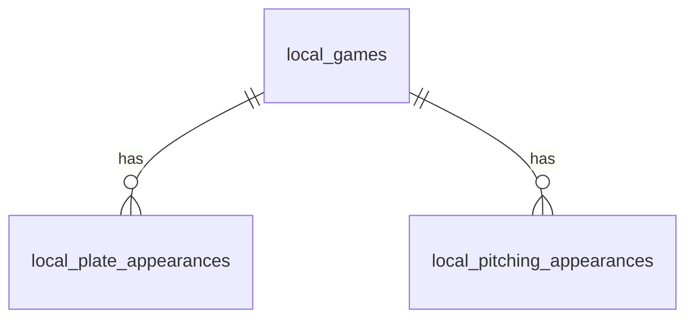

# テーブル設計書

## MVP1 ローカル用テーブル設計（SQLite / Drift）

MVP1 では Supabase を使わず、端末内の SQLite に試合、打席、ピッチング成績を保存する。
ローカル版は「自分の端末で記録して、自分の端末で成績を見る」ことに特化するため、ユーザー、チーム、選手、共有、権限管理のテーブルは持たない。

### 方針

- DB: SQLite
- 実装: Drift
- DB ファイル: `base_match_local.sqlite`
- ID: アプリ側で生成した UUID 文字列を `TEXT` として保存する
- 選手名: MVP1 では保存しない
- チーム: master テーブルを作らず、試合ごとにチーム名を文字列で保存する
- 集計: 保存済みの打席、ピッチング成績からアプリ側で集計する

### ローカルテーブル一覧

| テーブル | 役割 |
|---|---|
| `local_games` | 試合情報を保存する |
| `local_plate_appearances` | 自チームの打席結果を保存する |
| `local_pitching_appearances` | 自チームのピッチング成績を保存する |

### local_games

試合の基本情報を保存する。
MVP1 ではチーム master を作らないため、自チーム名と相手チーム名は文字列として保持する。

| カラム | 型 | null | 備考 |
|---|---|---|---|
| id | text | no | pk。アプリ側で生成した UUID 文字列 |
| date | datetime | no | 試合日 |
| location | text | yes | 球場 |
| home_team_name | text | no | 自チーム名 |
| away_team_name | text | no | 相手チーム名 |
| home_score | integer | yes | 自チーム得点 |
| away_score | integer | yes | 相手チーム得点 |
| status | text | no | `draft` / `final` |
| innings | integer | yes | イニング数 |
| created_at | datetime | no | 作成日時 |

### local_plate_appearances

自チームの打席結果を保存する。
MVP1 では選手名を扱わず、チーム合計の打撃成績を集計するためのイベントとして保存する。

| カラム | 型 | null | 備考 |
|---|---|---|---|
| id | text | no | pk。アプリ側で生成した UUID 文字列 |
| game_id | text | no | `local_games.id` への参照 |
| inning | integer | yes | イニング |
| result_type | text | no | `hit` / `out` / `walk` / `error` |
| result_detail | text | no | `single` / `double` / `triple` / `home_run` / `strikeout` など |
| rbi | integer | yes | 打点 |
| created_at | datetime | no | 作成日時 |

### local_pitching_appearances

自チームのピッチング成績を保存する。
MVP1 では打席入力から投手成績を自動計算せず、登板単位の集計値を手入力で保存する。

| カラム | 型 | null | 備考 |
|---|---|---|---|
| id | text | no | pk。アプリ側で生成した UUID 文字列 |
| game_id | text | no | `local_games.id` への参照 |
| outs_pitched | integer | no | 投球アウト数。1回 = 3、1/3回 = 1 |
| runs | integer | no | 失点 |
| earned_runs | integer | no | 自責点 |
| hits_allowed | integer | no | 被安打 |
| walks | integer | no | 与四死球 |
| strikeouts | integer | no | 奪三振 |
| home_runs_allowed | integer | no | 被本塁打 |
| created_at | datetime | no | 作成日時 |

### リレーション



### ローカル版では作らないテーブル

| テーブル | 作らない理由 |
|---|---|
| users | ログインを扱わないため |
| teams | チーム master を作らず、試合ごとの文字列で十分なため |
| team_members | チーム共有、権限管理を扱わないため |
| players | MVP1 では選手名を扱わないため |
| claims | 仮プレイヤーの本人化を扱わないため |
| audit_logs | ローカル単体で監査ログが不要なため |
| share 関連 | 因縁カード共有を扱わないため |

### 集計方針

打撃成績は `local_plate_appearances` から集計する。

| 指標 | 集計元 |
|---|---|
| 打席数 | `local_plate_appearances` の件数 |
| 打数 | ヒット、アウト、エラー系の件数 |
| 安打 | `result_type = hit` |
| 本塁打 | `result_detail = home_run` |
| 四死球 | `result_type = walk` |
| 三振 | `result_detail = strikeout` |
| 打率 | 安打 / 打数 |

ピッチング成績は `local_pitching_appearances` から集計する。

| 指標 | 集計元 |
|---|---|
| 登板数 | `local_pitching_appearances` の件数 |
| 投球回 | `outs_pitched / 3` |
| 失点 | `runs` の合計 |
| 自責点 | `earned_runs` の合計 |
| 被安打 | `hits_allowed` の合計 |
| 与四死球 | `walks` の合計 |
| 奪三振 | `strikeouts` の合計 |
| 防御率 | 自責点 * 27 / 投球アウト数 |

---

# クラウド用テーブル設計（Supabase / Postgres）

**方針**：イベントソーシング寄り（打席イベントが一次データ）

集計は Materialized View / SQL View / Edge Function / バックグラウンド集計のいずれか。
MVPは「SQL View + 必要に応じてキャッシュテーブル」推奨。

補足:

- 本書の `public` スキーマは「ログイン後にクラウド保存するデータ」を対象とする
- 未ログイン利用時の試合・打席・個人成績は端末内ストレージで保持し、直接 Supabase には保存しない
- 共有された因縁カードの無料閲覧は、将来的に公開用テーブルまたは公開用ビューを別で持つ前提とする

---

## 目次

- [1. ID方針](#1-id方針)
- [2. テーブル一覧](#2-テーブル一覧)
  - [users](#users)
  - [teams](#teams)
  - [team_members](#team_members)
  - [players](#players)
  - [games](#games)
  - [plate_appearances](#plate_appearances)
  - [claims](#claims)
  - [audit_logs](#audit_logs)
- [3. ビュー（集計）](#3-ビュー集計)
  - [v_matchup_batter_pitcher](#v_matchup_batter_pitcher)
  - [v_matchup_team_team](#v_matchup_team_team)
- [4. RLS（Row Level Security）方針（MVP）](#4-rlsrow-level-security方針mvp)
- [5. トリガー](#5-トリガー)
  - [on_auth_user_created](#on_auth_user_created)
- [6. RPC関数](#6-rpc関数)
  - [join_team_by_invite_code](#join_team_by_invite_code)
- [付録A：結果コード（MVP）](#付録a結果コードmvp)
- [付録B：集計定義（MVP）](#付録b集計定義mvp)

---

## 1. ID方針

- uuid（Postgres `gen_random_uuid()`）
- Supabase Auth の `auth.users(id)` を `users.id` として参照（外部キー + `on delete cascade`）

---

## 2. テーブル一覧

### users

| カラム | 型 | 備考 |
|--------|-----|------|
| id | uuid | pk, references auth.users(id) on delete cascade |
| display_name | text | not null |
| photo_url | text | null |
| created_at | timestamptz | not null default now() |

※ サインアップ時に `on_auth_user_created` トリガーで自動作成される（[5. トリガー](#5-トリガー)参照）

### teams

| カラム | 型 | 備考 |
|--------|-----|------|
| id | uuid | pk |
| name | text | not null |
| area | text | null |
| photo_url | text | null |
| invite_code | text | unique not null |
| created_by | uuid | not null references users(id) |
| created_at | timestamptz | not null default now() |

### team_members

| カラム | 型 | 備考 |
|--------|-----|------|
| id | uuid | pk |
| team_id | uuid | not null references teams(id) |
| user_id | uuid | not null references users(id) |
| role | text | not null ('owner'\|'admin'\|'member') |
| created_at | timestamptz | not null default now() |

※ unique (team_id, user_id)

### players

プレイヤーは「ユーザー本人」または「仮プレイヤー」

| カラム | 型 | 備考 |
|--------|-----|------|
| id | uuid | pk |
| team_id | uuid | null references teams(id) - 所属不明/仮もあり得る |
| display_name | text | not null |
| user_id | uuid | null references users(id) - nullなら仮 |
| created_by | uuid | not null references users(id) - 仮を作った人 |
| created_at | timestamptz | not null default now() |

### games

| カラム | 型 | 備考 |
|--------|-----|------|
| id | uuid | pk |
| date | date | not null |
| location | text | null |
| home_team_id | uuid | not null references teams(id) |
| away_team_id | uuid | not null references teams(id) - 仮チーム対応するなら別途 opponent_teams |
| home_score | int | null |
| away_score | int | null |
| status | text | not null default 'draft' ('draft'\|'final') |
| innings | int | null - イニング数 (3, 5, 7, 9) |
| created_by | uuid | not null references users(id) |
| created_at | timestamptz | not null default now() |

### plate_appearances

| カラム | 型 | 備考 |
|--------|-----|------|
| id | uuid | pk |
| game_id | uuid | not null references games(id) |
| inning | int | null |
| batter_player_id | uuid | not null references players(id) |
| pitcher_player_id | uuid | not null references players(id) |
| result_type | text | not null ('out'\|'hit'\|'walk'\|'error') |
| result_detail | text | not null ('single'\|'double'\|'triple'\|'hr'\|'k'\|'fly'… etc) |
| rbi | int | null |
| created_by | uuid | not null references users(id) |
| created_at | timestamptz | not null default now() |

### claims

仮プレイヤーの本人化

| カラム | 型 | 備考 |
|--------|-----|------|
| id | uuid | pk |
| player_id | uuid | not null references players(id) |
| claimed_user_id | uuid | not null references users(id) |
| status | text | not null default 'approved' - MVPは即時。将来 'pending'\|'approved'\|'rejected' |
| created_at | timestamptz | not null default now() |

### audit_logs

| カラム | 型 | 備考 |
|--------|-----|------|
| id | uuid | pk |
| actor_user_id | uuid | not null references users(id) |
| entity_type | text | not null ('game'\|'plate_appearance'\|'player'…) |
| entity_id | uuid | not null |
| action | text | not null ('create'\|'update'\|'delete') |
| payload | jsonb | not null |
| created_at | timestamptz | not null default now() |

---

## 3. ビュー（集計）

### v_matchup_batter_pitcher

- 粒度：batter_player_id × pitcher_player_id
- 指標：
  - ab（打数）, h（安打）, hr, bb_hbp, so, avg
  - last_n は別ビュー or クエリ（order by game.date desc limit N）

### v_matchup_team_team

- 粒度：home_team_id × away_team_id（対称性のため正規化キー推奨：小さいuuidをA側に）
- 指標：
  - games, wins, losses, runs_for, runs_against

**注：対称性の正規化キー**

```sql
team_a = least(home_team_id, away_team_id)
team_b = greatest(home_team_id, away_team_id)
```

---

## 4. RLS（Row Level Security）方針（MVP）

- **teams/team_members**: 所属ユーザーのみ参照
- **games/plate_appearances**: 試合の home/away のいずれかのチームに所属するユーザーのみ参照
- **players**:
  - 自チーム所属の players は参照可能
  - opponent の仮プレイヤーは「該当試合に関与する場合のみ参照」
- **claims**: 当事者のみ参照
- **共有閲覧用データ**:
  - 認証必須データとは切り離す
  - 共有済み因縁カードの閲覧専用データだけを匿名公開する

---

## 5. トリガー

### on_auth_user_created

サインアップ時（`auth.users` へのINSERT後）に `public.users` レコードを自動作成するトリガー。

| 項目 | 内容 |
|------|------|
| トリガー名 | `on_auth_user_created` |
| 対象テーブル | `auth.users` |
| タイミング | AFTER INSERT, FOR EACH ROW |
| 実行関数 | `public.handle_new_user()` |
| セキュリティ | SECURITY DEFINER |

**処理内容**:
- `auth.users.id` → `public.users.id`
- `auth.users.raw_user_meta_data->>'display_name'` → `public.users.display_name`（未設定時は「名無し」）

```sql
insert into public.users (id, display_name)
values (new.id, coalesce(new.raw_user_meta_data ->> 'display_name', '名無し'));
```

---

## 6. RPC関数

### join_team_by_invite_code

招待コードを使ってチームに参加するRPC関数。サーバー側でバリデーションを行い、不正な参加を防ぐ。

| 項目 | 内容 |
|------|------|
| 関数名 | `public.join_team_by_invite_code(p_invite_code text)` |
| 戻り値 | `uuid`（参加したチームのID） |
| セキュリティ | SECURITY DEFINER |
| 権限 | `authenticated` ロールのみ実行可能 |

**バリデーション**:
1. 認証チェック — `auth.uid()` が null なら `UNAUTHENTICATED` エラー
2. チーム存在チェック — 招待コード（大文字化＆トリム済み）でチームを検索、見つからなければ `TEAM_NOT_FOUND` エラー
3. 重複チェック — 既にメンバーなら `ALREADY_MEMBER` エラー

**処理内容**: バリデーション通過後、`team_members` に `role='member'` で挿入し、チームIDを返す。

**Flutterからの呼び出し例**:
```dart
final teamId = await supabase.rpc('join_team_by_invite_code', params: {
  'p_invite_code': inviteCode,
});
```

---

## 付録A：結果コード（MVP）

| result_type | result_detail |
|-------------|---------------|
| hit | single, double, triple, hr |
| out | k, ground, fly, line, dp, other |
| walk | bb, hbp |
| error | e |

---

## 付録B：集計定義（MVP）

| 指標 | 定義 |
|------|------|
| AB（打数） | result_type in ('hit','out','error') ※errorはABに含める運用 |
| H（安打） | result_type='hit' |
| HR | result_detail='hr' |
| BB/HBP | result_type='walk' |
| SO | result_detail='k' |
| AVG | H / AB（AB>0） |
